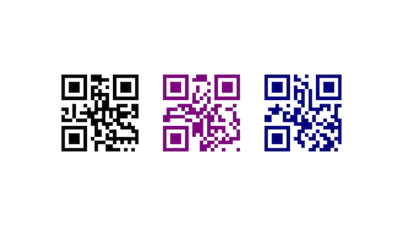

# react-native-quark

[![npm][npm-badge]](https://www.npmjs.com/package/react-native-quark)
[![code style: standard][standard-badge]](https://standardjs.com)
[![code style: prettier][prettier-badge]](https://prettier.io/)

[npm-badge]: https://img.shields.io/npm/v/react-native-quark.svg
[standard-badge]: https://img.shields.io/badge/code_style-standard-brightgreen.svg
[prettier-badge]: https://img.shields.io/badge/code_style-prettier-ff69b4.svg

An ART-based qrcode component for react-native, which is much **faster** than those based `WebView`.



## Prerequisite

This library is based on [ART][art-library] and works on both Android and iOS platform.

[ART][art-library] has already been included in react-native, while not avaiable on iOS. Please follow the [document][manual-linking] to **link ART on iOS manually**.

[art-library]: https://github.com/facebook/react-native/tree/master/Libraries/ART
[manual-linking]: https://facebook.github.io/react-native/docs/linking-libraries-ios.html#manual-linking

## Usage

* Install

```bash
npm i react-native-quark
```

* Use it

```jsx harmony
import React from 'react'
import { StyleSheet, View } from 'react-native'
import Quark from 'react-native-quark'

export default () => (
  <View style={styles.container}>
    <Quark value="Hello!" />
    <Quark value="Quark!" style={styles.quark} />
    <Quark value="您好!" color="navy" />
  </View>
)

const styles = StyleSheet.create({
  container: {
    flex: 1,
    justifyContent: 'center',
    alignItems: 'center'
  },
  quark: {
    margin: 40,
    color: 'purple'
  }
})
```

## Prop Types

|              Name | Type      | Default       | Description                       |
| ----------------: | --------- | ------------- | --------------------------------- |
|             value | `string`  | -             | QRCode content, **required**      |
|              size | `?number` | 128           | size of the QRCode                |
|             color | `?string` | 'black'       | color of the QRCode               |
|   backgroundColor | `?string` | 'transparent' | background color of the QRCode    |
| errorCorrectLevel | `?string` | 'M'           | `errorCorrectLevel` of the QRCode |
|             style | `any`     | null          | style of `ART.Surface` component  |

> You can set `color` and `backgroundColor` in `style`.

## Acknowledge

The word "QR Code" is registered trademark of [DENSO WAVE INCORPORATED][denso-wave].
And you can use it without any fee, according to [QR Code FAQ][qrcode-faq].

[denso-wave]: https://www.denso-wave.com/
[qrcode-faq]: http://www.qrcode.com/en/faq.html

## License

[MIT](./LICENSE)
